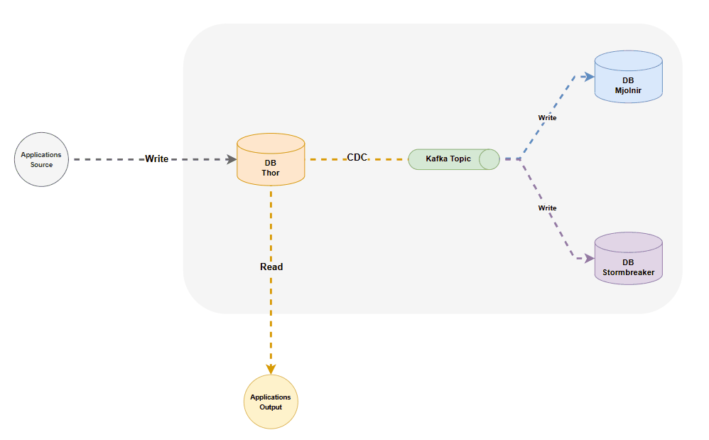

# System Database Replication

This project has been as target ilustrated how works a system database replication.

## Architecture

### System Architecture



---

### Repository Path Tree

```bash
.
├── Makefile
├── README.md
├── docker
│   └── docker-compose.yaml
├── poetry.lock
├── pyproject.toml
└── src
    ├── configs
    │   └── postgresql.conf
    ├── connectors
    │   ├── sink-mjolnirdb-connector.json
    │   ├── sink-stormbreakerdb-connector.json
    │   └── source-thordb-connector.json
    ├── main.py
    ├── pipe
    │   ├── ingestion.py
    │   └── orchestration.yml
    ├── scripts
    │   ├── getAvroPackages.sh
    │   └── initdb.sh
    └── sinarm_dbt
        ├── analyses
        ├── dbt_packages
        ├── dbt_project.yml
        ├── models
        │   ├── refined
        │   │   ├── dim_abrangencia.sql
        │   │   ├── dim_calibre.sql
        │   │   ├── dim_categoria.sql
        │   │   ├── dim_especie_arma.sql
        │   │   ├── dim_genero.sql
        │   │   ├── dim_marca.sql
        │   │   ├── dim_municipio.sql
        │   │   ├── dim_ocorrencia.sql
        │   │   ├── dim_status.sql
        │   │   ├── dim_tipo_porte.sql
        │   │   ├── dim_uf.sql
        │   │   ├── fat_ocorrencia.sql
        │   │   ├── fat_portes.sql
        │   │   └── fat_registros.sql
        │   ├── schema.yml
        │   ├── source.yml
        │   └── staging
        │       ├── stg_ocorrencias.sql
        │       ├── stg_portes.sql
        │       └── stg_registros.sql
        ├── package-lock.yml
        ├── packages.yml
        ├── profiles.yml
        ├── seeds
        └── snapshots
```

## How it works

This project use 3 databases, with the following names:

* ThorDB
* MjolnirDB
* StormbreakerDB

Data is replicated from the source database, ThorDB, to the target databases, MjolnirDB and StormbreakerDB. This replication is achieved using Kafka Connect, which streams data changes from the source database to the target databases in real-time. The frequency of data replication is optimized to ensure that changes made to one database are promptly synchronized across the entire system.

## Benefits

1. **Reliability and performance**: If one copy of the database has an issue, another can take over to ensure continuous availability.

2. **Data consistency**: All copies of the data are kept up to date with the latest information.

3. **Data availability**: Users can access copies of the same data, even if one version is unavailable.

## Install & Config

### Makefile (Linux Only)

* ```make build```: Build the docker images, containers and set kafka connectors.
* ```make destroy```: Remove the docker images and containers.
* ```make run```: Run ETL sample.
* ```make py-dependencies```: To install the Python dependencies.

### Manual Installation

For manual installations, you can copy the commands found in the **Makefile** and execute them in the terminal.

## Author

* 😎 [João Soares](https://github.com/joaoallmeida)
